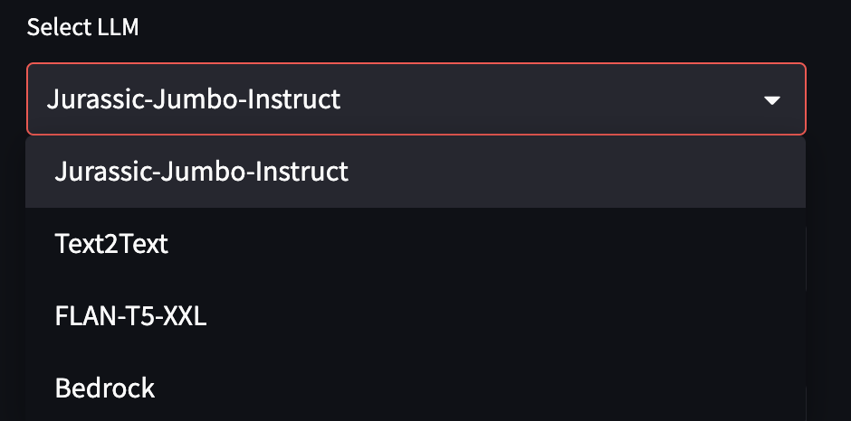
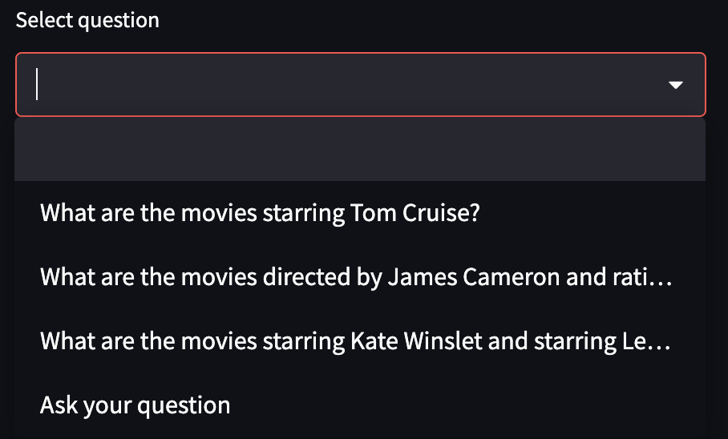
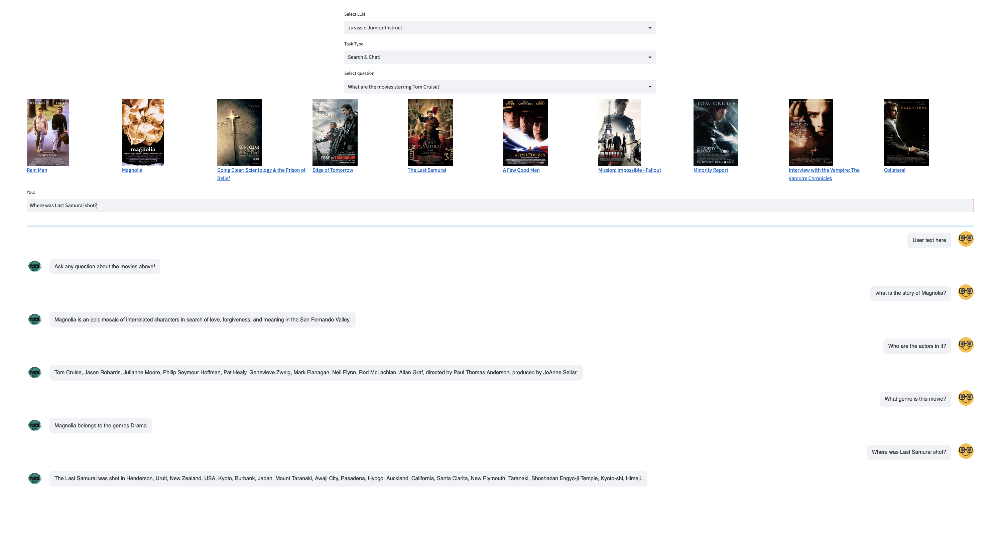

# IMDb Conversational Search App

This repo contains the code to launch a chatbot app that can help users learn more about the movies in IMDb database through conversation search powered by LLMs and LangChain.

Dataset used: MovieLens + IMDb Mojo Dataset

VectorDB: OpenSearch with 100K records

LLM: Anthropic Claude from Amazon Bedrock, Jurassic Jumbo Instruct, Text2Text, Flan T5 XXL

LLM Framework: LangChain

UI Framework: Streamlit

### Features

1. Users have a choice of LLM to select for the conversational search bot: 

2. There are two task types that the user can choose from: (Search) or (Search and Chat). First, the LLM searches for movies based on the user query, and then if the chat option is provided, a chat feature is provided to the user. 

The UI provides a set of default questions for the search use case as shown below: 

These default as well as user inputted search questions can be grouped as either: 
- Exact match: searching for movies based on location, actor, plot, rating, directors, etc..
- Semantic match: searching for movies that are similar to others 
- Trending: searching for movides that are trending now (Disclaimer: these look at tmdb instead of imdb)

Currently, the chat bot supports 5 questions at a time to not break context length

## Instructions to Run Demo

### Set up
1. Run `sh setup.sh` to install dependencies
2. Process IMDb dataset as per [notebooks/IMDB_Dataset_Preprocessing](notebooks/IMDB_Dataset_Preprocessing)
3. Create OpenSearch cluster
4. Create OpenSearch index by running `python index_creation.py --imdb_file s3://mlsl-imdb-data/imdb_ml_10k_posters.parquet --index_name imdb_small_posters` from the folder `src`
5. Test chat functionality as per [notebooks/Chat_Functionality.ipynb](notebooks/Chat_Functionality.ipynb)

### Bedrock Setup: Optional
In terminal: 
1. sh bedrock_install.sh

### Test Streamlit Chat App
1. From folder `streamlit` run `streamlit run chat.py`
2. In another terminal run `bash run.sh` to get the local SM Studio app URL 

## Contributors
Divya Bhargavi, dbharga@amazon.com
Gaurav Rele, grele@amazon.com
Suren Gunturu, gunsuren@amazon.com

## ToDo
1. Add demo to demos.aiml.aws.dev
2. Add personalization in chat to offer movie recommendation.
3. Test models that support longer context to increase chat context range.